# How tests are named

how-tests-are-named is a repository containing data referring to test methods extracted from the 500 most popular Github repositories (by the stars metric), divided into 5 languages, namely: C#, Go, Java, JavaScript and Python.

The collection of test methods was carried out taking into account the diff of files modified in each commit over the last 2 years in each repository of each language. Within these diffs, the method names were extracted using regular expressions.

In the collection process, some peculiarities of each language were taken into account for the construction of regular expressions, as can be seen in a summarized form in the table below:

  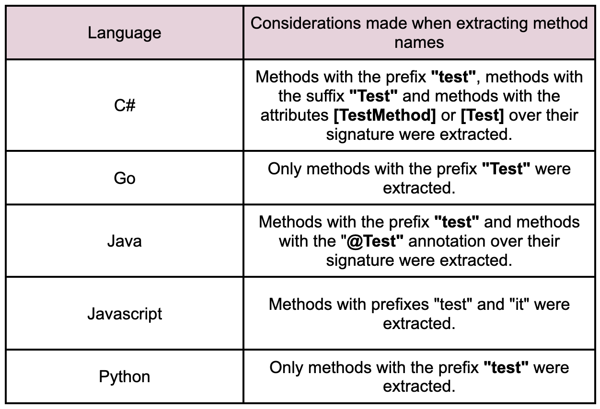

With the method names extracted, the next step was to split these names into tokens, which was done using [Spiral](https://github.com/casics/spiral), a Python package that implements several identifier division algorithms.

This parsing was used to avoid the problem of differently constructed method names that deviate from the standard case-sensitive styles. Methods called "**test_isfile**" or "**readUTF8stream**", for example, are good patterns that make it difficult to just use regular expressions to parse them, with numbers as abbreviations and different delimiters in the same word. After splitting, these methods would be separated into component tokens: [test, is, file] and [read, utf8, stream]. Finally, among the identifier options available in Spiral, we made use of the Ronin splitter, an advanced splitter that uses a variety of heuristic rules, English dictionaries, and token frequency tables obtained from mining source code repositories.

Thus, in this repository you will find data such as:
- Names of methods extracted from all repositories of each language.
- The prefix of each method taking into account all language repositories.
- Some interesting numerical metrics, such as "Total quantity of prefixes", "Total quantity of tokens", "Method with the most quantity of tokens", "Method with the most quantity of characters", "Average number of tokens", and "Average number of characters".
- The tokens that make up each of the extracted methods, by language.

Below is a table illustrating some methods collected for each language:

  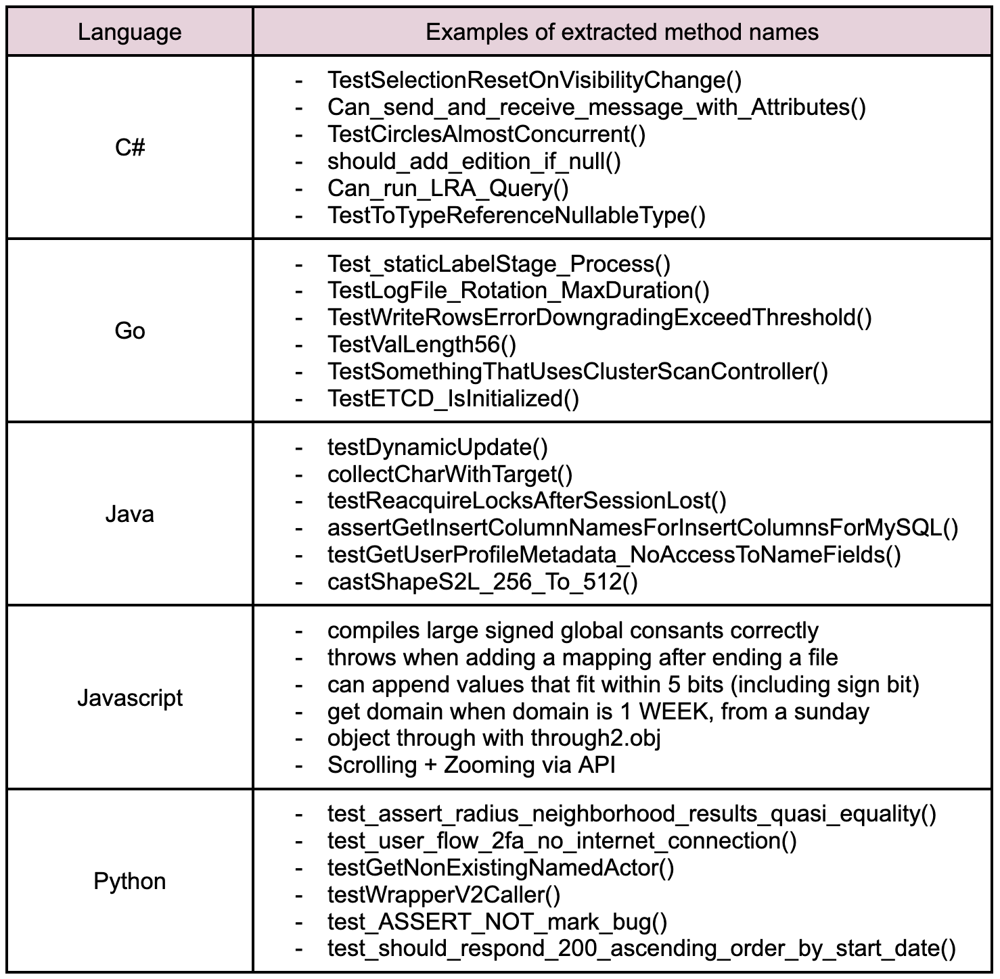

A detailed explanation of the available data can be found in the [README](/Users/lessa/vit_tcc/poc-cc-ufmg-2023-1/data/README.md) available inside the "data" folder.

## Motivation

Abstraction and creativity are the core of programming. The ability to create numerous solutions to a problem shows the freedom that programmers have when building their systems. However, with a focus on naming methods, this task has a great impact on programmers' ability to understand the purpose of a function, which can be unfavorable if this method is a test.

Thus, this repository aims to make available the data referring to the test methods collected for the 5 languages in order to make possible, through several possible analyses, to have an initial comparative study between the languages in different categories.

## Some interesting metrics

In addition to the **data** folder containing all the extracted data files, an **analysis** folder was also made available, which contains a [Jupyter Notebook](/Users/lessa/vit_tcc/poc-cc-ufmg-2023-1/analysis/final_graphs.ipynb) with some initial metrics. Please feel free to make a copy of this notebook and add any constructive new analysis to the study topic. 

Now about the metrics:

- The graph below shows the amount of tokens extracted for each language. 

  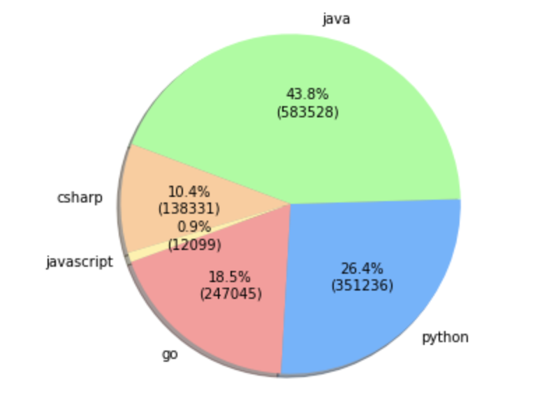

Note that the amount of tokens extracted for Java was substantially greater than the others, while for JavaScript it was substantially smaller, even though all languages were subjected to the same collection criteria. Thus, an interesting step to take is to think of solutions to balance the database, so that we have similar amounts of methods for the 5 languages, and as a consequence, more coherent analyses.

- The table below exposes the 5 prefixes that most appeared in the test methods for each language.

  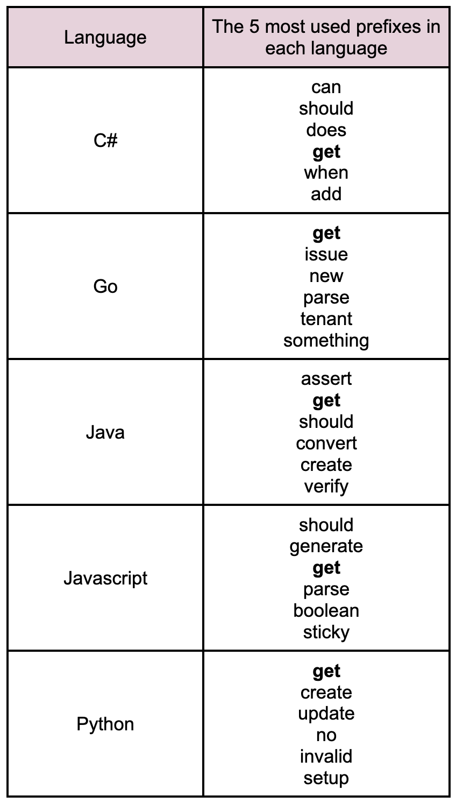

Note that the "get" prefix is the only one common to all languages. This metric is interesting because it is able to show us whether the tokens most used by developers vary a lot according to the language. When looking at the prefixes, it is possible to notice a certain similarity in their choice.

- Still in this scenario, an interesting complementary metric concerns the grammatical structure of these tokens. The table below shows the 3 most frequent grammatical structures in method prefixes for each language.

  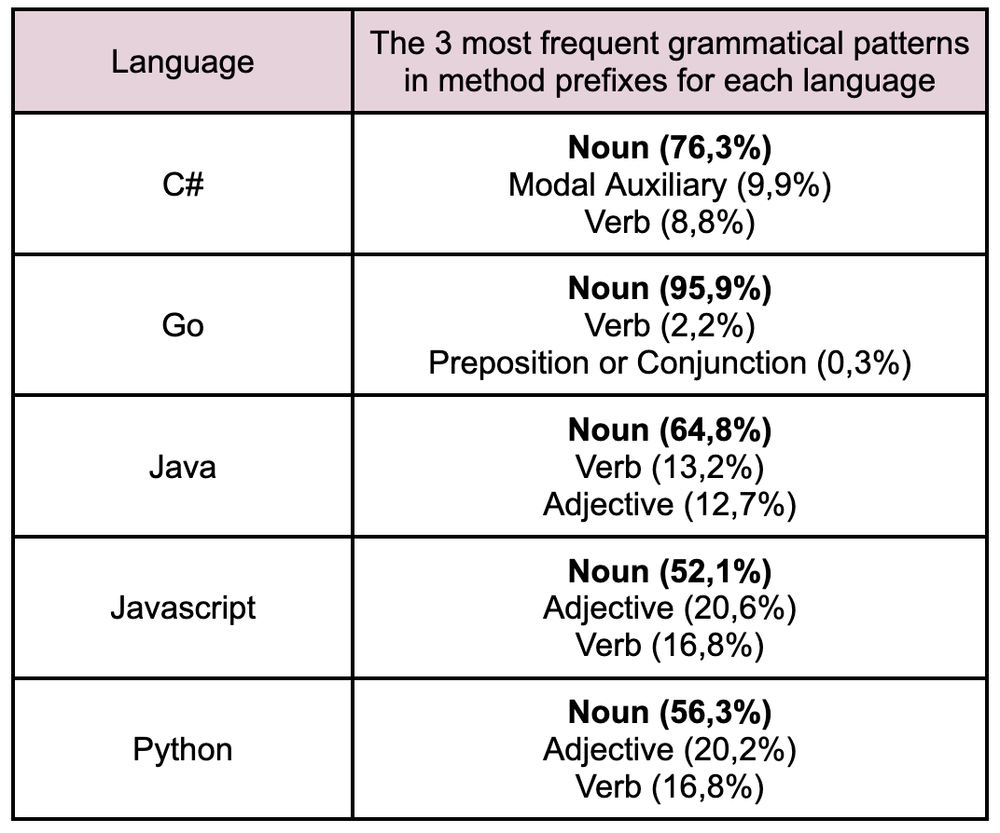

Note that for all of them, the Noun appears first. However, because they are prefixes, the majority class was expected to be verbs, since prefixes usually indicate the purpose of that test.

## Classifications of the main methods

[Host and Ostvold](https://ieeexplore.ieee.org/document/4362913) shows us a dictionary to indicate the purpose of the method according to its prefix. Given this guide along with the above analysis, we can classify the most common methods in each language.

The Table below shows the relationship between prefix and the purpose of the method that uses it for some of the most commonly used prefixes in each of the languages:

  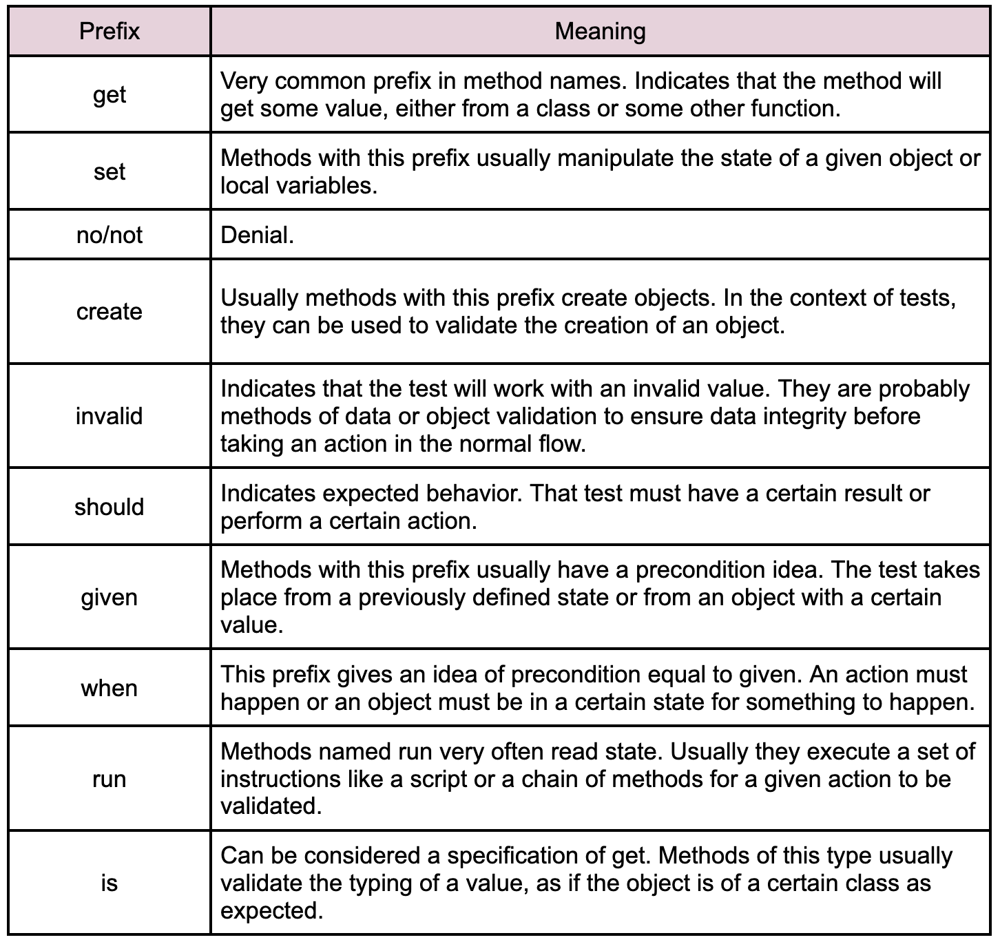

## A comparative summary between languages

Below you can find a comparative summary for each language taking into account 4 standards, namely the **length of methods**, the **tokens reuse**, the **grammatical structures and classes**, and the **popular methods**.

  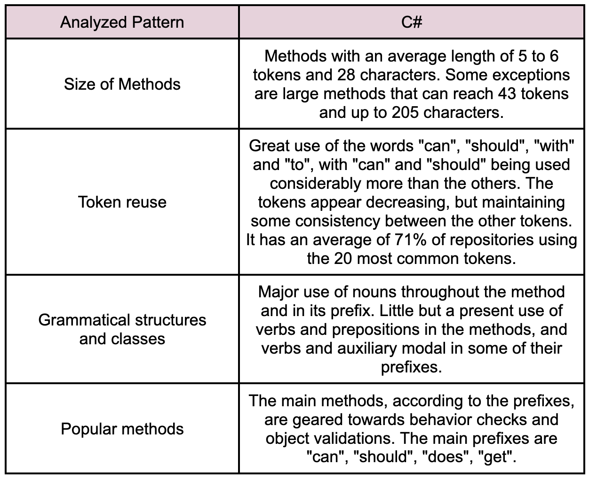

  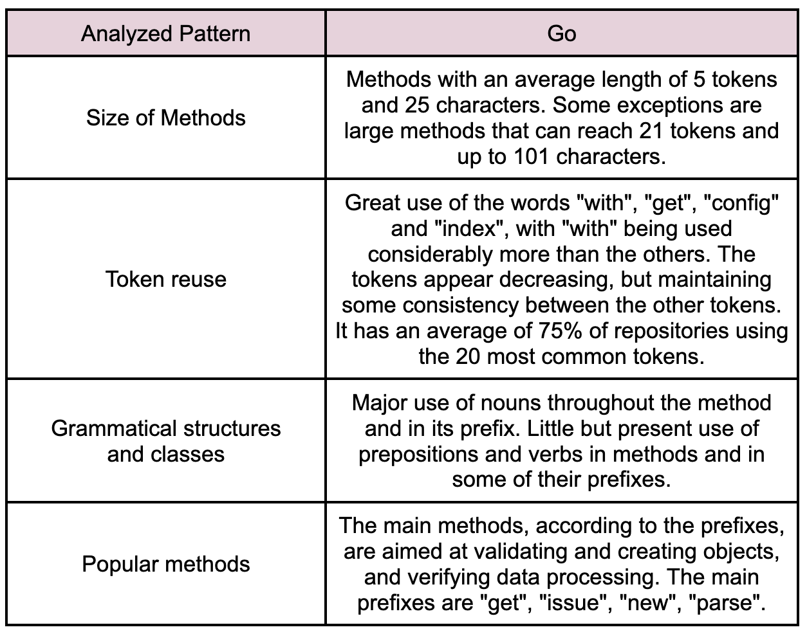

  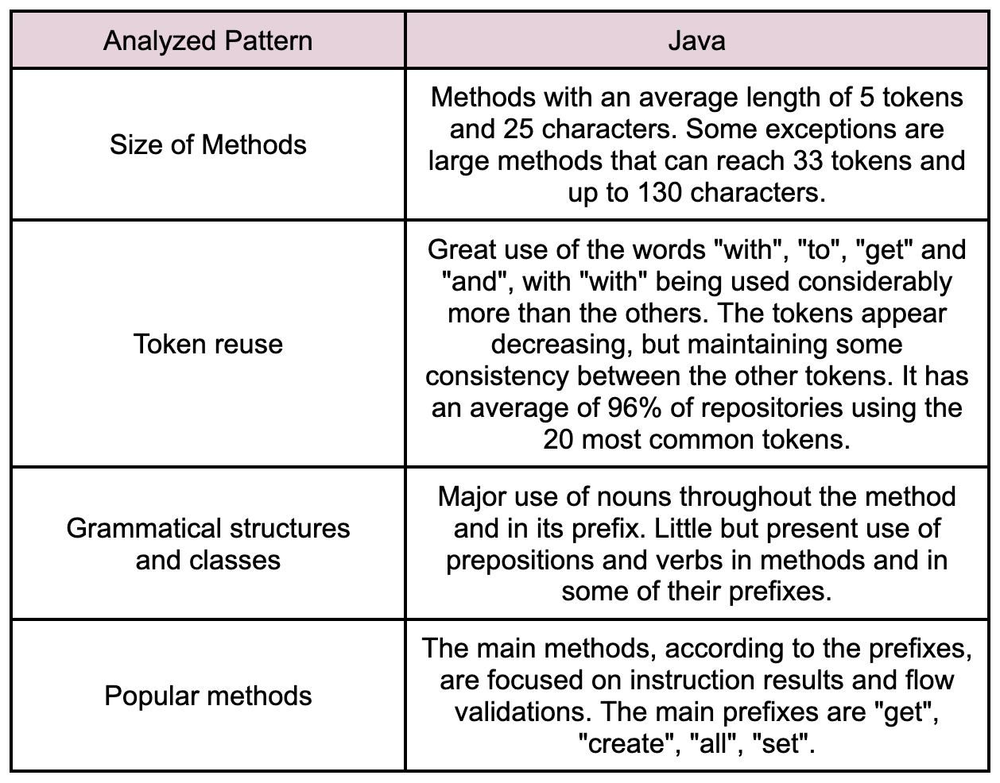

  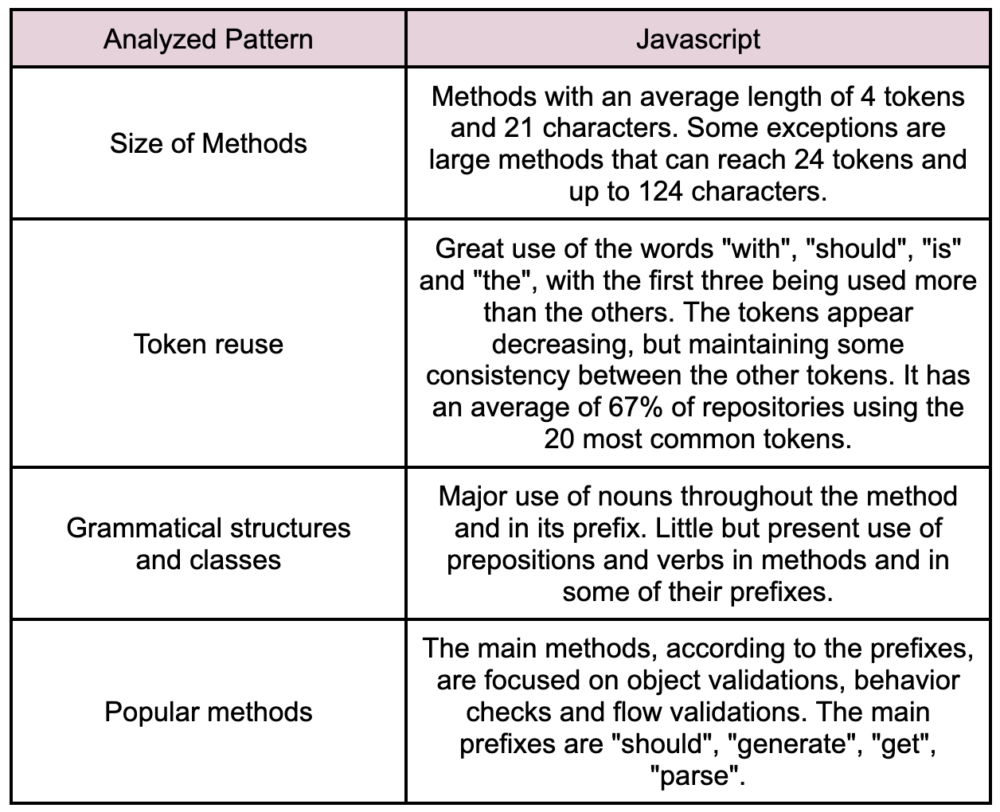

  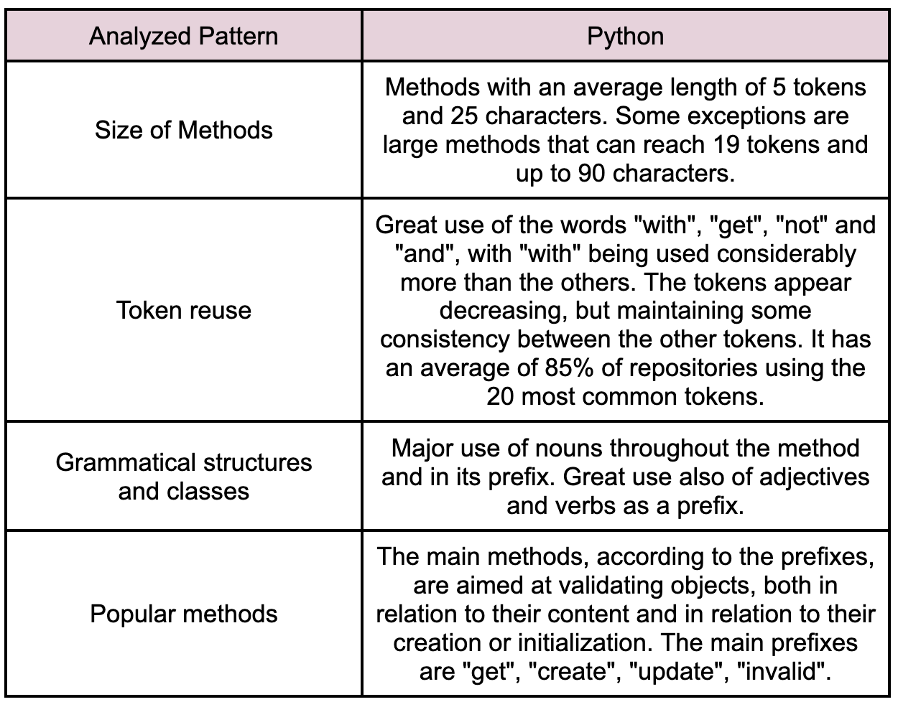

## Contribution Guidelines

Please ensure your pull request adheres to the following guidelines:

* Search previous suggestions before making a new one, as yours may be a duplicate.
* Suggested READMEs should be beautiful or stand out in some way.
* Make an individual pull request for each suggestion.
* New categories, or improvements to the existing categorization are welcome.
* Keep descriptions short and simple, but descriptive.

Thank you for your suggestions!
